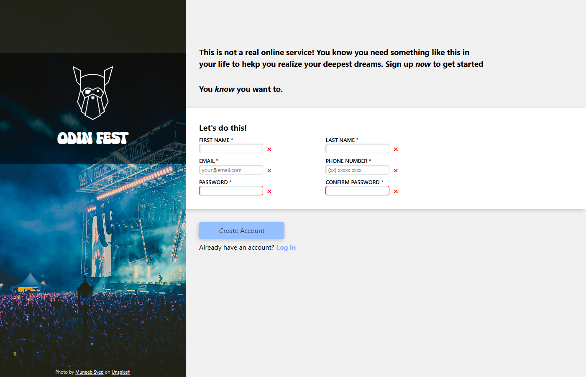
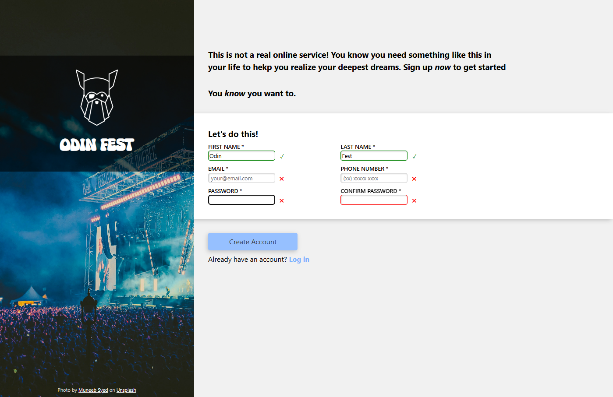

# 📝 Sign-up Form Project - The Odin Project Intermediate HTML & CSS

## 🚀 Project Overview

This **Sign-up Form** was built as part of *The Odin Project’s Intermediate HTML and CSS Course*.  
The goal was to design a visually appealing, accessible, and semantically structured sign-up page for an imaginary service using **pure HTML and CSS**, applying layout, form, and validation concepts learned throughout the course.

---

## ✨ Features

- **Split Layout Design:** The page is divided into two main sections — an image sidebar and the form container — aligned using Flexbox.  
- **Custom Background Image:** A high-resolution photo from Unsplash creates an engaging visual identity.  
- **Logo Overlay:** The “ODIN FEST” logo is displayed over a semi-transparent dark background to enhance text readability.  
- **Custom Local Fonts:** One font (`Super Festival`) is integrated via `@font-face`, adding personality to the design.  
- **Visual Form Validation:**  
  - Green borders and ✓ icons indicate valid input.  
  - Red borders and ✖ icons indicate invalid input.  
  - Password fields use regex pattern validation (`^(?=.*[a-z])(?=.*[A-Z])(?=.*\d).{8,12}$` for at least one number, one lowercase and one uppercase letter).  
- **Interactive Button Design:** “Create Account” button includes hover transitions and a subtle shadow.  
- **CSS Variables:** Used for consistent color theming and easy future adjustments.  
- **Accessibility Considerations:** Proper `label` associations, placeholders, and contrast management for readability.

---

## 🛠️ Technologies Used

- **HTML5:** Semantic form structure and accessibility-friendly markup.  
- **CSS3 (Flexbox):** For layout management, responsive alignment, and form styling.  
- **Custom Fonts:** Implemented via `@font-face` using locally hosted `.woff2` and `.woff` files.  
- **No JavaScript:** The project intentionally relies solely on CSS and HTML validation for this stage of the curriculum.

---

## 💡 What I Learned & Reinforced

Through this project, I solidified key front-end skills:

- **Advanced CSS Selectors & Pseudo-classes:** Practical use of `:valid`, `:invalid`, and sibling selectors for real-time form feedback.  
- **Form Validation with Regex:** Controlled password strength via the `pattern` attribute.  
- **Custom Fonts Integration:** Loading local fonts and managing performance with `font-display: swap`.  
- **CSS Variables & Scalability:** Applied a consistent design system using `--variables` for colors and spacing.  
- **Design Accessibility:** Improved text readability with overlays and balanced `text-wrap` behavior.  
- **Box Model Reset:** Applied a modern reset to standardize styling across browsers.

---

## ⚙️ How to Run

Try it [LIVE](https://bgns42.github.io/project-sign-up-form/) or Clone the repository and open the project locally:

```bash
# Clone the repository
git clone https://github.com/BGNS42/project-sign-up-form.git

# Navigate to the project folder
cd project-sign-up-form

# Open the HTML file
Open index.html in your preferred browser
```

## 📸 Screenshots




## 🚧 Challenges & Solutions

1. **Visual Form Validation Feedback**

    *Challenge*: Create clear and accessible validation feedback without JavaScript.

    *Solution*: Used CSS pseudo-classes (:valid, :invalid) and sibling selectors with pseudo-elements (::before) to display ✓ and ✖ icons dynamically.

2. **Font Loading Optimization**

    *Challenge*: Integrate local fonts while keeping page performance high.

    *Solution*: Implemented @font-face with .woff2 priority and font-display: swap to prevent rendering delays.

3. **Layout & Spacing Management**

    *Challenge*: Balance content distribution between the image and form areas.

    *Solution*: Used Flexbox and CSS clamp() functions to create proportional and adaptive spacing.

## 🧑‍💻 Author
Made by [BGNS42](https://github.com/bgns42)
Feel free to connect with me on [LinkedIn](https://www.linkedin.com/in/igor-carrasco) or explore my other projects on GitHub!

## 📸 Image Credit

Photo by [Muneeb Syed](https://unsplash.com/pt-br/@muneebs?utm_content=creditCopyText&utm_medium=referral&utm_source=unsplash) on [Unsplash](https://unsplash.com/pt-br/fotografias/multidao-e-palco-4_M8uIfPEZw?utm_content=creditCopyText&utm_medium=referral&utm_source=unsplash)

## 📄 License
This project is open-source and available under the [MIT License](https://github.com/BGNS42/Project-Etch-a-Sketch/blob/main/LICENSE).
